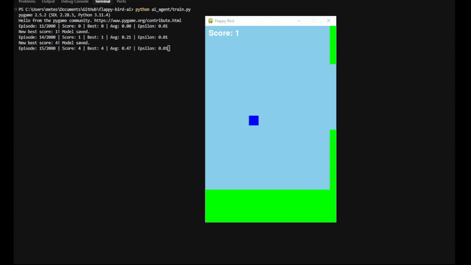
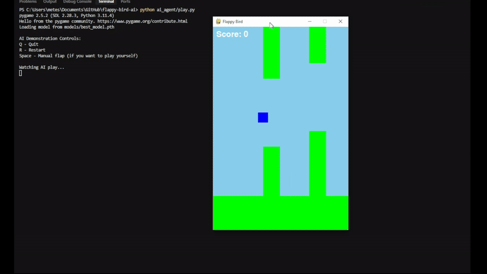

# Flappy Bird AI

A Flappy Bird game implementation with an AI agent that learns to play using Deep Q-Learning. The project demonstrates the application of reinforcement learning in game development.

## Features

- Classic Flappy Bird gameplay
- AI agent using Deep Q-Learning
- Real-time visualization of AI training
- Model persistence and loading
- Configurable game parameters
- Thread-safe implementation for smooth gameplay

## Demo

### Training Process


### AI Playing


## Project Structure

```
flappy-bird-ai/
├── ai_agent/
│   ├── model.py      # DQN model and agent implementation
│   ├── train.py      # Training script with visualization
│   └── play.py       # Script to watch AI play
├── game/
│   ├── __init__.py
│   └── flappy_bird.py # Game implementation
├── models/           # Saved model checkpoints
├── requirements.txt  # Project dependencies
└── README.md        # Project documentation
```

## Game Settings

The game's difficulty and behavior can be adjusted by modifying the constants in `game/flappy_bird.py`:

```python
# Game Constants
SCREEN_WIDTH = 400
SCREEN_HEIGHT = 600
GRAVITY = 0.25
FLAP_STRENGTH = -5    # Controls jump height
PIPE_SPEED = 4        # Controls game speed
PIPE_GAP = 200        # Controls gap size between pipes
PIPE_FREQUENCY = 1000 # Controls distance between pipes
GROUND_HEIGHT = 100
```

These settings can be adjusted to:
- Make the game easier or harder
- Change the learning difficulty for the AI
- Adjust the visual appearance
- Modify the game's physics

## Installation

1. Clone the repository:
```bash
git clone https://github.com/MeteSayan/flappy-bird-ai.git
cd flappy-bird-ai
```

2. Create and activate a virtual environment:
```bash
python -m venv venv
source venv/bin/activate  # On Windows: venv\Scripts\activate
```

3. Install dependencies:
```bash
pip install -r requirements.txt
```

## Usage

### Training the AI

To train the AI agent:
```bash
python ai_agent/train.py
```

The training process includes:
- Real-time visualization of the game
- Progress tracking with score and epsilon values
- Automatic model saving at regular intervals
- Best model preservation

### Watching the AI Play

To watch the trained AI play:
```bash
python ai_agent/play.py
```

Controls:
- Q: Quit
- R: Restart
- Space: Manual flap (optional)

## AI Implementation

The AI agent uses Deep Q-Learning with the following features:
- Experience replay for stable learning
- Target network for consistent Q-value estimation
- Epsilon-greedy exploration strategy
- Custom reward structure for better learning
- Thread-safe implementation for smooth gameplay

## Recent Updates

- Optimized game parameters for better AI learning
- Improved reward structure
- Enhanced visualization during training
- Added comprehensive documentation
- Implemented thread-safe operations

## Contributing

Feel free to submit issues and enhancement requests!

## License

This project is licensed under the MIT License - see the LICENSE file for details. 